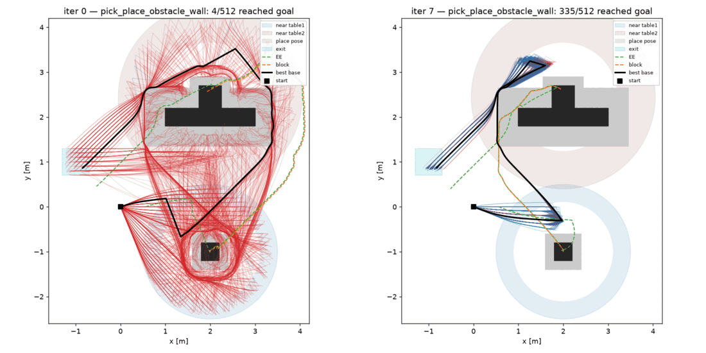
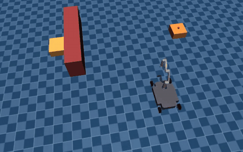
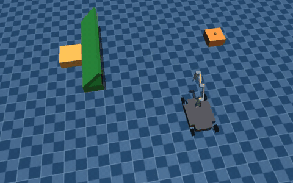
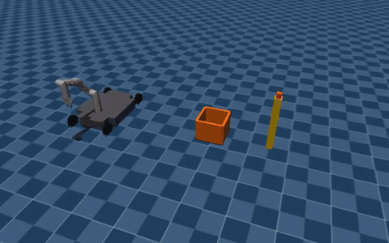
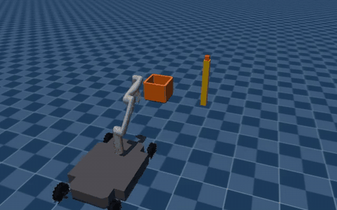
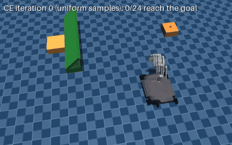

# Cross-Entropy Optimization of Physically Grounded Task and Motion Plans (MuJoCo Warp port)

[Paper (IEEE RA-L)](https://ieeexplore.ieee.org/document/11486591) ·
[arXiv](https://arxiv.org/abs/2512.11571) ·
[Project website](https://andreumatoses.github.io/research/parallel-realization)

This repository implements the method of the following paper on the GPU, with
[MuJoCo Warp](https://github.com/google-deepmind/mujoco_warp):

> A. Matoses Gimenez, N. Wilde, C. Pek, and J. Alonso-Mora, "Cross-Entropy Optimization of
> Physically Grounded Task and Motion Plans," *IEEE Robotics and Automation Letters*, 2026.

> [!WARNING]
> **This code is a port. It did not produce the results in the paper.**
> The paper results come from the original implementation in NVIDIA Isaac Gym, with
> geometric fabrics for whole-body control and A* for base paths. This repository
> implements the same method in MuJoCo Warp, with simpler GPU controllers. The simulator,
> the controllers, some parameter regions and the CE settings are different (see
> [Differences from the paper](#differences-from-the-paper)). Thus the costs, success
> rates, solution modes and run times are not the same as in the paper.

## Method

A symbolic plan is a fixed sequence of skills (`move`, `pick`, `place`, `push`). Each skill
has continuous parameters: base goals, grasp orientations, and place or push poses.
Cross-entropy (CE) optimization samples these parameters from symbolic regions, for
example a ring around a table. The GPU simulates all sampled plans in parallel, together
with their low-level controllers. The cost of a plan is the number of simulation steps
until each of its actions succeeds.

The CE loop in `ce.py`, in pseudocode:

```text
modes = [uniform prior over the regions]            # one Gaussian per region and mode
for it in 0 .. iters-1:
    Z = N samples, split evenly over the modes      # iteration 0: uniform in the regions
        + a share of fresh uniform samples          # (b) --explore
    roll out all Z in parallel on the GPU
    cost = steps until each action succeeds;  ok = symbolic goal reached
    score = cost                                    # (c) --robust-k: mean cost of the k
                                                    #     nearest samples, failures = full horizon
    pool = plans with ok, best score first          # if none: most successful actions,
                                                    #          then smallest distance to the goal
    split pool into clusters with k-means           # (a) --n-modes (default: 1 cluster)
    for each cluster:
        elites = its best plans
        fit mean and std per dimension              # (d) --elite-temp: weights exp(-rank / T)
return the best-scoring plan of all iterations      # (c): the cluster mean with the lowest
                                                    #      expected cost in a validation batch
```

Without the options (a) to (d), the loop follows the CE of the paper, with the small
differences in [Differences from the paper](#differences-from-the-paper). The options are
not in the paper, and they are off by default. They help rare solution modes, such as the
ramp slide, to survive against common modes. `notes/ramp_mode_tuning.md` explains each
option and the tests behind it.



*Pick and place around a wall: base paths of 512 sampled plans at CE iteration 0 (left,
uniform samples) and iteration 7 (right). Blue: plan reaches the goal. Red: plan fails.
Black: best plan.*

## Paper experiments

| Paper experiment | Command | Result of this port |
| --- | --- | --- |
| P1 pick and place, case 1: rectangular obstacle | `uv run python examples/pick_place_obstacle.py --variant wall` | Drives around the wall, as in the paper. |
| P1 pick and place, case 2: ramp obstacle | `uv run python examples/pick_place_obstacle.py --variant ramp` with the CE options below | In some runs, releases the cube on the ramp, and the cube slides onto table 2. In the other runs, drives around the ramp. |
| P1 case 2, regions moved to the slide | `uv run python examples/pick_place_obstacle.py --variant ramp_forced` | Releases the cube on the ramp, and the cube slides onto table 2. |
| P2 move and push, case 1: box between robot and stick | `uv run python examples/stick_and_box.py --variant between` | Drives around the box and pushes the stick into the box. |
| P2 move and push, case 2: stick on the right | `uv run python examples/stick_and_box.py --variant right` | Pushes the stick toward the box. |

<table>
  <tr>
    <td><br>P1, case 1: wall (2x speed)</td>
    <td><br>P1, case 2: ramp slide, with the CE options (2x speed)</td>
  </tr>
  <tr>
    <td><br>P2, case 1: box between robot and stick</td>
    <td><br>P2, case 2: stick on the right</td>
  </tr>
</table>

**The ramp slide.** The wall and ramp variants use the same regions. In the paper, CE
found the slide in 6 of 10 runs. In this port, slide plans are rare among the first samples,
so the default CE settings converge to a plan that drives around the ramp. The CE options
(a) to (d) of the [Method](#method) section keep the rare slide mode alive:

```bash
uv run python examples/pick_place_obstacle.py --variant ramp --iters 14 --n 6144 \
    --n-elite 51 --elite-temp 2 --n-modes 3 --explore 0.15 --robust-k 16
```



*24 sampled plans of one such run, shown as ghosts (4x speed), at CE iterations 0 (uniform
samples), 2 and 14. The samples come from the distribution of the cluster that holds the
best plan. At iteration 2, that cluster drives around the ramp. At iteration 14, it
releases the cube on the ramp, and the cube slides onto table 2.*

With these options, the result still changes from run to run. The slide won in 2 of 2
final runs of `notes/ramp_mode_tuning.md`, and in 1 of 2 of our later re-runs. The other
re-run drove around the ramp. The cost advantage of the slide also changes: 2494 against
3116 steps for the wall in the tuning log, but 3222 against 3181 to 3258 steps in our
re-runs. The returned plans reached the goal in 99 % to 100 % of the validation replicas.
One run takes approximately 9 min on an RTX 4070.

The `ramp_forced` variant moves the approach and place regions to the slide. It finds the
slide with the default settings, but its plans are fragile (see Repeatability).

## Setup

Requirements:

- Linux with an NVIDIA GPU and a CUDA driver. Warp and MuJoCo Warp run on CUDA only.
- [uv](https://docs.astral.sh/uv/). uv installs Python 3.13 and all dependencies.

```bash
git clone https://github.com/AndreuMatoses/tamp_ce_mjwarp.git
cd tamp_ce_mjwarp
uv sync
uv run pytest    # IK and grasp checks
```

We tested the code on Ubuntu 24.04 (WSL2) with an RTX 4070.

## Usage

Run all commands from the repository root. The scene paths are relative to it.

Each CE example runs 8 iterations with 512 samples and 30 elites. The main options are
`--iters`, `--n`, `--n-elite`, `--seed`, `--camera behind|top|gripper`, `--last-plot-only`,
and the CE options of the [Method](#method) section (`--n-modes`, `--elite-temp`,
`--explore`, `--robust-k`). The outputs go to `solutions/<scenario>/`, or to
`solutions/<scenario>_<tag>/` with `--tag <tag>`:

- `<scenario>.h5`: the best plan, and the best plan and fitted distribution of each
  iteration.
- `<scenario>.mp4`: a video of the best plan.
- `iter_XX.png`: base, end-effector and object paths of all samples in iteration `XX`.
- `<scenario>_ce.png` and `<scenario>_elite.png`: CE convergence plots.
- `parameter_regions.png` and `vi_move*.png` (pick and place only): the sampling regions
  and the navigation cost-to-go of each move.

If no plan reaches the goal, the file names get the suffix `_best_effort`, and the files
show the plan closest to the goal.

On an RTX 4070, one run takes 1 to 1.5 min for pick and place and less than 1 min for move
and push. The first run also compiles the Warp kernels (approximately 35 s). Later runs use
the kernel cache.

To inspect the results:

```bash
# replay a saved plan in the MuJoCo viewer (needs a display)
uv run python examples/replay_solution.py solutions/pick_place_obstacle_wall/pick_place_obstacle_wall.h5
# render it to a video instead (headless, EGL)
uv run python examples/replay_solution.py <file.h5> --video out.mp4
# replay the best plan of CE iteration 0
uv run python examples/replay_solution.py <file.h5> --iter 0
# render many sampled plans superposed in one scene
uv run python examples/replay_batch.py pick_place_obstacle_wall --video batch.mp4
# one superposed segment per CE iteration of a saved run, at 4x speed
uv run python examples/replay_batch.py pick_place_obstacle_wall \
    --from-solution solutions/pick_place_obstacle_wall/pick_place_obstacle_wall.h5 \
    --all-iters --video iterations.mp4 --n 32 --speed 4
# show the sampling regions of a scenario in the viewer
uv run python examples/visualize_scenario.py stick_and_box_between
```

**Repeatability.** The MuJoCo Warp contact simulation on the GPU is not bit-wise
deterministic. Two runs with the same `--seed` give different numbers. A replay of a saved
plan can also end differently from the CE rollout that scored it. In our tests, the plans
of the default settings for the wall, the ramp and both push cases reached the goal in 61
to 64 of 64 replays. The slide plan of `ramp_forced` reached the goal in 45 of 64. The
`--robust-k` option prefers plans that keep working under these differences. `plan.replay`
logs a warning when a replay does not reach the goal.

## Differences from the paper

| | Paper (Isaac Gym) | This port (MuJoCo Warp) |
| --- | --- | --- |
| Simulator | Isaac Gym (PhysX), time step 1/50 s | MuJoCo Warp, time step 0.003 s, Newton solver |
| Pick, place and push control | Geometric fabrics: whole-body end-effector pose control with collision avoidance | Batched whole-body IK at the start of the action. The arm moves to the IK joint goal at a capped joint speed, and the base drives to the IK base pose. No collision avoidance. |
| Move control | A* path and PID waypoint tracking | Value-iteration cost-to-go on an occupancy grid (GPU). The base follows its gradient. |
| Samples per iteration | 3000, linearly down to 300 at iteration 10 | Fixed, 512 by default |
| Elite samples and iterations | 50 and 20 | 30 and 8 by default |
| Elites when no plan reaches the goal | Plans in which all actions succeed | Plans with the most successful actions, then the smallest distance to the goal |
| CE options | None | Optional clusters (modes), exploration share, rank weights and robust scoring (see [Method](#method)) |
| Regions | As in the paper | Changed for the new controllers. For example: a table 2 ring of 1.2 m to 2.05 m (paper: 1.2 m to 1.7 m), a place box that starts at y = 1.7 m, a 0.6 m x 0.6 m exit region (paper: 1 m x 1 m), a place pose without orientation, and a full yaw range for the grasp orientation. |
| Move-and-push scene | 0.8 m stick, box 0.8 m from the stick | 0.6 m stick, box 0.62 m from the stick |

## Code layout

```
src/tamp_ce_mjwarp/
  ce.py         CE loop: sample, roll out, select elites, fit new distributions
  plan.py       ActionSpec and the batched Rollout (one CUDA graph per skill)
  actions.py    Warp control kernel of each skill
  ik.py         batched whole-body IK
  nav.py        value-iteration navigation field
  regions.py    sampling regions
  scenarios.py  scene, regions, plan and goal of each example
  sim.py        model loading and patches
  viz.py        rendering, plots, HDF5 input and output
scenes/         MJCF scenes
robot_models/   Dinova robot: Clearpath Dingo-O base and Kinova Gen3 Lite arm
examples/       entry points
tests/          IK and grasp tests
```

`notes/warp_tutorial.md` explains how the code uses Warp and CUDA graphs.
`notes/ramp_mode_tuning.md` records the tuning of the ramp scenario and of the CE options.
`CLAUDE.md` gives the steps to add a skill or a scenario, and lists known simulation traps.

## Citation

```bibtex
@article{matoses2026crossentropy,
  title   = {Cross-Entropy Optimization of Physically Grounded Task and Motion Plans},
  author  = {Matoses Gimenez, Andreu and Wilde, Nils and Pek, Chris and Alonso-Mora, Javier},
  journal = {IEEE Robotics and Automation Letters},
  year    = {2026},
  doi     = {10.1109/LRA.2026.3685463}
}
```

## License

The code is under the MIT license (see [LICENSE](LICENSE)). The robot meshes come from the
Kinova Gen3 Lite and Clearpath Dingo robot description files, and their original licenses
apply.

This work was supported by the European Union through ERC INTERACT, Grant 101041863.
